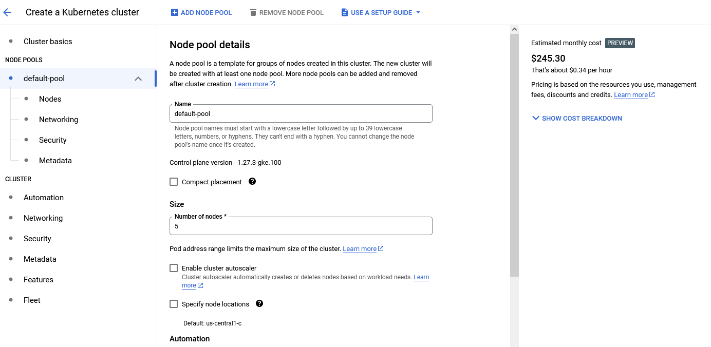
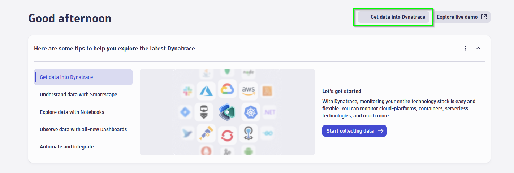
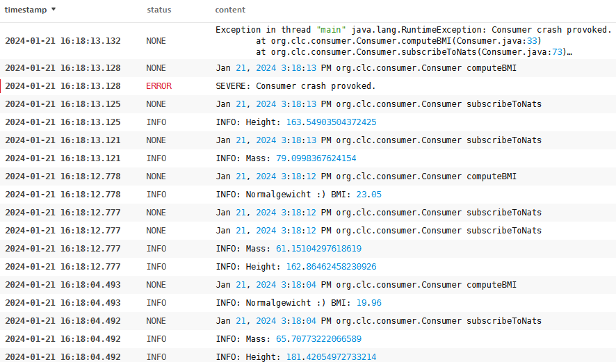
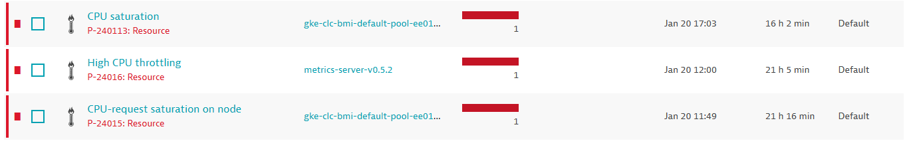

# Cloud computing project "Dynatrace"

## Members
- Jakob Mayr
- Daniel Stütz

## Summary of research
### About Dynatrace
The company [Dynatrace](https://www.dynatrace.com/) develops a platform which enables a high amount of observability and security in 
cloud computing applications. By the help of Dynatrace, one can create custom dashboards which can monitor
Applications, Services, Infrastructure, Databases and more. If systems get unhealthy in a cloud computing
environment like a Google Cloud Kubernetes cluster, the platform can detect these problems and report them to
the corresponding maintenance team. It also helps monitor logs, observe the amount of replicas of a pod and much
more.

### About NATS.io
[NATS](https://nats.io/) is a technology which enables distributed applications to communicate with each other in a secure way.
For example, NATS can be used as a message queue between microservices. It is based on multiple open source projects
and is used by thousands of companies worldwide, e.g. Ferrari, mastercard, PayPal and Walmart. The communication
via NATS can be realized with NATS clients, which can be implemented in most programming languages like Python, Java,
JavaScript and C#. NATS is completely free to use and the published under the Apache-2.0 Open Source License.

## Tutorial
### Overview
In this tutorial, you will learn how to deploy a small amount of microservices in Google Cloud Kubernetes and
later monitor them using the Dynatrace monitoring platform.  
First the producer is generating a random height and mass of a person, and sends this data to a NATS message queue.
Consumers are subscribed to this queue, receive the message and calculates the body mass index (BMI) based on the
randomly generated vital parameters. The Consumer then classifies the BMI as underweight, normal, overweight or the
level of obesity.  
These applications are then monitored via the Dynatrace monitoring platform. Users can create dashboards
to see the overall healthiness of the system, filter logs etc.  


### GKE - Google Kubernetes Engine
We are using the Google Kubernetes Engine - short GKE - for our project. Therefore, the first step is to set 
up a new Kubernetes Cluster via the [Google Cloud interface](https://console.cloud.google.com/kubernetes/). You can keep most of the
default settings, you will only need to increase the number of nodes (more on that later).  


### Implementation of Java-applications
Next, we need to implement the logic for the producer and consumer.

#### Producer
The producer generates a normally distributed mass and height for later BMI calculation. In our case, we chose 
$\sigma=10$ and $\mu=70$ for body mass and $\sigma=10$ and $\mu=175$ for height.
Finally, use
```java
try {
    this.natsConnection = Nats.connect("nats://ip.of.nats:4222");
} catch (Exception e) {
    this.logger.severe("Connection to NATS failed:" + e.getMessage());
}
```
to connect to the NATS service and

```java
producer.natsConnection.publish("vitalparameters", message.getBytes());
```
to send a message to the NATS service with the subject `vitalparameters`.

#### Consumer
The consumer subscribes to the subject `vitalparameters` and receives the message as soon as a new one was published
by the producer. The connection to the NATS service works like it did for the producer. Subscribing to the `vitalparamters`
subject can be done with
```java
natsConnection.subscribe("vitalparameters");
```

Next, you can use 
```java
Message msg = sub.nextMessage(0);
```

to infinitely wait for the next message to be published and then receive the message as `msg`. After parsing the height
and mass, you can use the formula $$BMI = \frac{massInKg}{heightInM^2}$$ to calculate the body mass index. Finally, the
consumer logs the classification of the BMI, as already declared in the [Overview](#overview) section.

### Containerization
We are using **Docker** to create docker images by using three different Dockerfiles:
- DockerfileProducer: This Dockerfile is used to build the producer image
- DockerfileConsumer: This Dockerfile is used to build the consumer image
- DockerfileBad: This Dockerfile is used to build a malfunctioning producer, which keeps crashing when deployed in Kubernetes. More on why we are using this Dockerfile later.

Since we need to include the NATS client dependency in our docker images, [Maven](https://maven.apache.org/) is used.
Therefore, we also need a `pom.xml` file for declaring the dependencies and building instructions for Maven.

By using a **CI-pipeline**, we are automatically building the images and pushing them to [DockerHub](https://hub.docker.com/repository/docker/danielstuetz/clc-bmi-producer/general).
For further information about the CI-pipeline, please check out the CI-pipeline file.

For the deployment of our microservices, we created a `deployment.yaml` file which starts up all three pod types using Kubernetes.  
After connecting to your Kubernetes cluster via `kubectl` you can use the command
```shell
kubectl apply -f deployment.yaml
```

to apply the deployment declared in `deployment.yaml`.

### Data Transfer
As already explained, the communication between producer and consumer works via a message queue implemented with NATS.io.
They way how to connect to the NATS service using the NATS Java client was already shown in the 
[implementation](#implementation-of-java-applications) section.  
You can set up a NATS.io message queue in Kubernetes by applying the following commands.   
Make sure that [Helm](https://helm.sh/) is installed beforehand.
```text
helm repo add nats https://nats-io.github.io/k8s/helm/charts/
helm install nats nats/nats
kubectl exec -it deployment/nats-box -- nats pub test hi
```
The last command is optional and only tests if the NATS service is up and running, by publishing the message `hi` on the
subject `test`. Remember, consumers can subscribe to subjects.

### Deploy Dynatrace monitoring
Now that all necessary microservices are running, we can deploy Dynatrace into the Kubernetes clustering for getting
deep insight in our cluster, get intelligent problem detection, log filtering and much more. Therefore, we need to register
for a Dynatrace trial. Once registered, log in to your [Dynatrace environment](https://sso.dynatrace.com/) and follow the steps as shown below.

Click on **Get data into Dynatrace** and select **Kubernetes**



Click on **Set up**


  fill out all necessary fields in the form shown below (**make sure you have "Enable volume storage"
turned on for GKE!**), download the generated yaml file and execute all shown commands. This should deploy dynatrace 
monitoring pods in your Google Cloud Kubernetes cluster. They can be found in an own namespace called `dynatrace`.  


Now your Dynatrace is all set up. You can now build own Dashboards, check detected problems, see logs, pods resources and much more.


### Getting system unhealthy
Everything is now up and running, so we can start to get our system unhealthy to see the advantages of using Dynatrace. 

#### Separate (bad) microservice
As already mentioned, we are using an own microservice called "bad" which is designed to fail when being deployed. This
was, we can see how Dynatrace detects and handles pods not being able to start up successfully.  
  
  
As you can see, Dynatrace can detect the "bad" pods not being able to start successfully.

#### Breaking the consumer
By raising an exception in the consumer, we are breaking the consumer on purpose to see what happens when the JVM is not
running anymore.
```java
if (rng.nextInt(1, 50) == 5) {
    this.logger.severe("Consumer crash provoked.");
    throw new RuntimeException("Consumer crash provoked.");
}
```
  

Dynatrace detects that the consumer gets slow and logs a warning. However, it does not detect that the consumer stops working
at all and that it should be restarted.

#### Putting heavy load on CPU
First, the producers were only publishing a new vital parameter every second. If you let the producers produce new messages
as fast as possible, while breaking the consumer, the CPU load gets really high.  
  
Dynatrace also detects the CPU load becoming unhealthy.


## Dynatrace advanced monitoring
You can also create monitoring Dashboard on your own for the maximum amount of flexibility in your Kubernetes observation.
At the time of creating this project, two different types of Dashboards can be built:

### Dashboard classic
This represents the new way of making Dashboards in Dynatrace. Users can design their own monitoring metrics, like
the amount of each pod types that are running, filtering and displaying logs and analyzing problems.


### Dashboard
This functionality provides the creation of dashboard the old way.  


## Lessons learned
- The error handling of Maven took a lot of time. First, we were able to build the image, but the image was not runnable.
  This was because of Maven needing a concrete project structure. Without the default project structure, Maven would not find
  the main class of the producer/consumer. We recommend using IntelliJ over VSCode in this case, since IntelliJ creates the
  proper project structure and needed pom.xml for adding the NATS.io dependency automatically.

- Setting up the message queue was not easy. First, we thought about deploying RabbitMQ to the cluster, but this would not have
  been intuitive to set up and would require a lot of effort (on which this project should not focus). We got the recommendation
  to try and set up NATS.io, which we got up and running quite fast.

- First, we were struggling with setting up Dynatrace because the option `Enable volume storage` was not enabled and we
at first did not know this had such a high impact. The errors we got did not explain the problem in an understandable way,
the logs only told us that the Dynatrace pods tried to create directories in a read only file system.

- We got the error "Pods not plannable" and saw that some Dynatrace pods were always pending and Dynatrace was not starting up.
The reason for this way, that we had too few nodes on our cluster available and therefore the pods did not have any place to
start. After increasing the amount of nodes, the problem was fixed. Again, the error message did not really help finding
the problem.

- Last but not least, introducing bugs in a program can be hard. 😉  
We tried our best to shut down the consumer pod by dividing by zero and raising exceptions on our own. First, dividing by zero
does not trigger a division by zero when the numerator is of type double. And second, even if we raise an exception on our own,
the JVM is shut down because of the exception, but the pod keeps running. We also wanted to show that the message queue 
gets flooded with messages once the consumers are down, but the system did not crash because of this. We guess that our 
message are just so small, that we would need billions of messages until we get an out of memory exception.  
In order to still show that Dynatrace can detect pods crashing continuously, we added the "bad" service. 


There is so much more you can do with Dynatrace we did not cover, so make sure you give it a try on your own! 😀